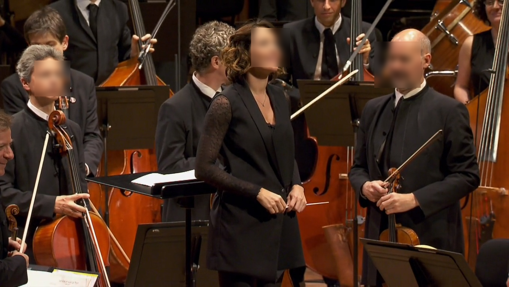

# BlureaTutti

A tiny essay on image anonymization. So far just works with faces (not all faces yet)

## What this script do

- Extracts images from docx files
- Extracts rectangles of faces using OpenCV Cascade classifier from extracted images
- Applies Gaussian Blur over the ROIs
- Saves anonymized images in a new folder

## Usage

I'm using [jjanzic/docker-python3-opencv](https://hub.docker.com/r/jjanzic/docker-python3-opencv) to easy install of OpenCV in Linux.

* docker pull jjanzic/docker-python3-opencv
* clone this repo
* load the docs folder with your docs
* docker run --rm --name opencv -v $(pwd):/tmp -it jjanzic/docker-python3-opencv /bin/bash
* cd tmp
* pip install -r requirements.txt
* python test.py
* see the results in anonymized folder

## Example

_The input document_

_The anonymized output_

## TODO

- Clean images folder after anonym....
- Add other clasiffiers (licence plates, etc.)
- Improve docker integration
- A lot of more things :)